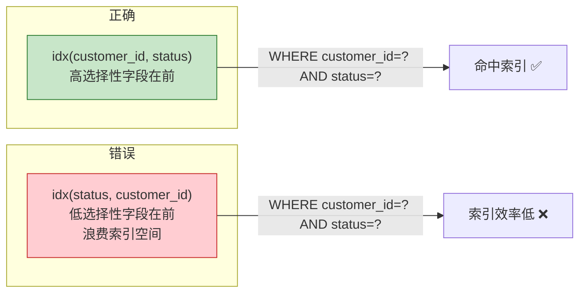
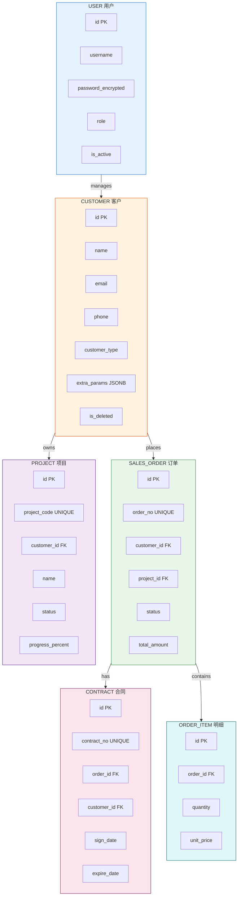

# PostgreSQL 数据库设计规范

> 适用场景：本项目 CRM 系统数据库设计
> 核心原则：性能优先、可维护性、扩展性

---

## 一、命名规范

### 1.1 表名
- **风格**：snake_case（小写+下划线）
- **单数形式**：`customer` 而非 `customers`
- **避免保留字**：不用 `order`、`user`、`group`（这些是 SQL 关键字）
- **示例**：
  ```sql
  customer          -- 客户表
  customer_address  -- 客户地址表（关联表）
  sales_order       -- 订单表（不用 order）
  contract          -- 合同表
  project           -- 项目表
  ```

### 1.2 字段名
- **风格**：snake_case
- **主键**：`id`（统一用小写）
- **外键**：`{关联表名}_id`，如 `customer_id`、`project_id`
- **时间字段**：`created_at`、`updated_at`、`deleted_at`
- **布尔字段**：`is_` 或 `has_` 前缀，如 `is_active`、`has_permission`

### 1.3 索引名
- **格式**：`idx_{表名}_{字段名}`
- **唯一索引**：`uq_{表名}_{字段名}`
- **复合索引**：`idx_{表名}_{字段1}_{字段2}`
- **示例**：
  ```sql
  idx_customer_email       -- customer.email 上的索引
  uq_sales_order_no        -- sales_order.order_no 唯一索引
  idx_sales_order_status_created_at  -- 复合索引
  ```

### 1.4 约束名
- **格式**：`fk_{表名}_{关联表名}`、`chk_{表名}_{约束描述}`
- **示例**：
  ```sql
  fk_orders_customer_id      -- 外键约束
  chk_orders_amount_positive -- 检查约束：金额>0
  ```

---

## 二、数据类型选择

| 场景 | 推荐类型 | 禁用类型 | 说明 |
|------|---------|---------|------|
| 主键 | BIGSERIAL | VARCHAR 作主键 | 自动递增，高效 |
| 整数计数 | INTEGER | VARCHAR | 别用字符串存数字 |
| 金额 | NUMERIC(12,2) | FLOAT/DOUBLE | 金融计算不能用浮点 |
| 布尔 | BOOLEAN | INTEGER/VARCHAR | 别用 0/1 表示布尔 |
| 时间 | TIMESTAMPTZ | DATE/VARCHAR | 带时区的时间戳 |
| 文本 | TEXT | VARCHAR(N) | PG 中 TEXT 和 VARCHAR 性能相同，TEXT 更灵活 |
| JSON | JSONB | JSON | JSONB 支持索引和查询 |
| IP地址 | INET | VARCHAR(15) | 原生网络类型 |
| UUID | UUID | CHAR(36) | 原生 UUID 类型 |
| 枚举 | ENUM 或 CHECK约束 | VARCHAR | 固定取值用枚举 |

### 2.1 金额字段规范
```sql
-- 正确
amount NUMERIC(12,2) NOT NULL DEFAULT 0,

-- 错误
amount FLOAT NOT NULL,          -- 浮点精度问题
amount VARCHAR(20) NOT NULL,    -- 无法做数值运算
```

### 2.2 时间字段规范
```sql
-- 推荐：带时区的时间戳
created_at TIMESTAMPTZ NOT NULL DEFAULT NOW(),
updated_at TIMESTAMPTZ NOT NULL DEFAULT NOW(),
deleted_at TIMESTAMPTZ            -- 软删除标记

-- 避免：不带时区
created_at TIMESTAMP NOT NULL,   -- 时区问题隐患
```

---

## 三、表设计原则

### 3.1 范式与反范式
```
第一范式（1NF）：每列不可再分         -- 必须遵守
第二范式（2NF）：非主键列完全依赖主键   -- 必须遵守
第三范式（3NF）：非主键列不依赖其他非主键 -- 必须遵守

反范式设计（允许）：
- 冗余字段：customer_name（冗余存储，避免JOIN）
- 预计算字段：total_amount（从明细汇总）
- 宽表：热点查询频繁时适度冗余
```

### 3.2 软删除
```sql
-- 所有业务表统一软删除
is_deleted BOOLEAN NOT NULL DEFAULT false,
deleted_at TIMESTAMPTZ,

-- 查询时统一加条件
WHERE is_deleted = false
```

### 3.3 审计字段
```sql
-- 所有表统一包含
created_at    TIMESTAMPTZ NOT NULL DEFAULT NOW(),
created_by    BIGINT,          -- 创建人ID（关联用户表）
updated_at    TIMESTAMPTZ NOT NULL DEFAULT NOW(),
updated_by    BIGINT,          -- 最后修改人ID
```

---

## 四、索引设计规范

### 4.1 必建索引
```sql
-- 1. 主键自动创建索引
ALTER TABLE customer ADD PRIMARY KEY (id);

-- 2. 外键字段
CREATE INDEX idx_orders_customer_id ON orders(customer_id);

-- 3. 高频查询字段
CREATE INDEX idx_customers_email ON customers(email);
CREATE INDEX idx_customers_phone ON customers(phone);

-- 4. 筛选字段（状态、类型等）
CREATE INDEX idx_orders_status ON orders(status);

-- 5. 时间范围查询
CREATE INDEX idx_orders_created_at ON orders(created_at DESC);

-- 6. 复合索引（遵循最左前缀）
CREATE INDEX idx_orders_status_created_at ON orders(status, created_at DESC);
```

### 4.2 复合索引设计原则



### 4.3 不要建的索引
- 低基数字段（只有几个不同值）单独建索引意义不大，如 `is_deleted`、`gender`
- 频繁更新的字段，索引维护成本高
- 索引数量控制：单表索引建议不超过 5 个，写多读少的表尽量少建索引

### 4.4 唯一索引
```sql
CREATE UNIQUE INDEX uq_customers_email ON customers(email);
CREATE UNIQUE INDEX uq_sales_order_no ON sales_order(order_no);
CREATE UNIQUE INDEX uq_project_customer ON projects(customer_id, project_code);
```

---

## 五、JSONB 使用规范

### 5.1 适用场景
```sql
-- 适合：动态属性、表单扩展字段
ALTER TABLE customer ADD COLUMN extra_params JSONB DEFAULT '{}';

-- 查询 JSONB 字段
SELECT * FROM customer
WHERE extra_params->>'loyalty_level' = 'gold';

-- 创建GIN索引加速JSONB查询
CREATE INDEX idx_customer_extra ON customer USING GIN(extra_params);

-- 索引化 JSONB 中的特定字段
CREATE INDEX idx_customer_loyalty ON customer ((extra_params->>'loyalty_level'));
```

### 5.2 不适用场景
- 需要频繁关联查询的字段 -> 拆分为独立表
- 需要强一致性的字段 -> 不要用 JSONB

---

## 六、分区表规范

### 6.1 适用条件
- 单表数据量 > 1000万行
- 有明显的时间维度可按范围分区

### 6.2 订单表分区示例
```sql
CREATE TABLE sales_order (
    id BIGSERIAL,
    order_no VARCHAR(32) NOT NULL,
    customer_id BIGINT NOT NULL,
    order_date DATE NOT NULL,
    amount NUMERIC(12,2),
    created_at TIMESTAMPTZ DEFAULT NOW(),
    PRIMARY KEY (id, order_date)
) PARTITION BY RANGE (order_date);

CREATE TABLE sales_order_2026_01 PARTITION OF sales_order
    FOR VALUES FROM ('2026-01-01') TO ('2026-02-01');

CREATE TABLE sales_order_2026_02 PARTITION OF sales_order
    FOR VALUES FROM ('2026-02-01') TO ('2026-03-01');
```

---

## 七、事务与锁

### 7.1 事务原则
- 事务尽量短，避免长事务
- 禁止：事务中包含 HTTP 请求、RPC 调用
- 禁止：事务中做复杂计算

### 7.2 锁机制
```sql
-- 行级锁：悲观锁
SELECT * FROM customer WHERE id = 1 FOR UPDATE;

-- 乐观锁：版本号控制
-- UPDATE customer SET version = version + 1, ...
--    WHERE id = 1 AND version = 5;
-- 影响行数=0 说明冲突，需重试
```

---

## 八、性能优化

### 8.1 EXPLAIN 分析
```sql
EXPLAIN (ANALYZE, BUFFERS, FORMAT TEXT)
SELECT * FROM customer WHERE email = 'test@example.com';
```
- `Seq Scan` -> 全表扫描，需加索引
- `Index Scan` -> 走了索引，正常
- `Buffers hit` -> 缓存命中率，越高越好

### 8.2 常见优化
```sql
-- 1. 避免 SELECT *
SELECT id, name, email FROM customer;  -- 正确
SELECT * FROM customer;                -- 错误

-- 2. 分页用游标替代 offset
SELECT * FROM customer WHERE id > 100000 ORDER BY id LIMIT 20;

-- 3. 批量操作
INSERT INTO customer (name, email) VALUES
    ('a', 'a@x.com'), ('b', 'b@x.com'), ('c', 'c@x.com');

-- 4. VACUUM 定期清理
VACUUM ANALYZE customer;
```

### 8.3 连接池配置
```yaml
spring:
  datasource:
    hikari:
      maximum-pool-size: 20
      minimum-idle: 5
      idle-timeout: 30000
      max-lifetime: 1800000
      connection-timeout: 30000
```

---

## 九、本项目数据库 ER 设计



---

## 十、SQL 编写检查清单

- [ ] 禁止 SELECT *
- [ ] 禁止在 WHERE 中对字段做函数运算
- [ ] 分页查询避免深 offset
- [ ] 批量操作使用 INSERT ... VALUES (), (), ()
- [ ] 所有表有 created_at、updated_at、is_deleted
- [ ] 金额字段用 NUMERIC 不用 FLOAT
- [ ] 时间字段用 TIMESTAMPTZ
- [ ] 外键字段有索引
- [ ] 高频查询字段有索引
- [ ] 敏感字段（手机号、身份证）加密存储
- [ ] 定期 VACUUM ANALYZE

---

*文档创建日期：2026-08-20*
