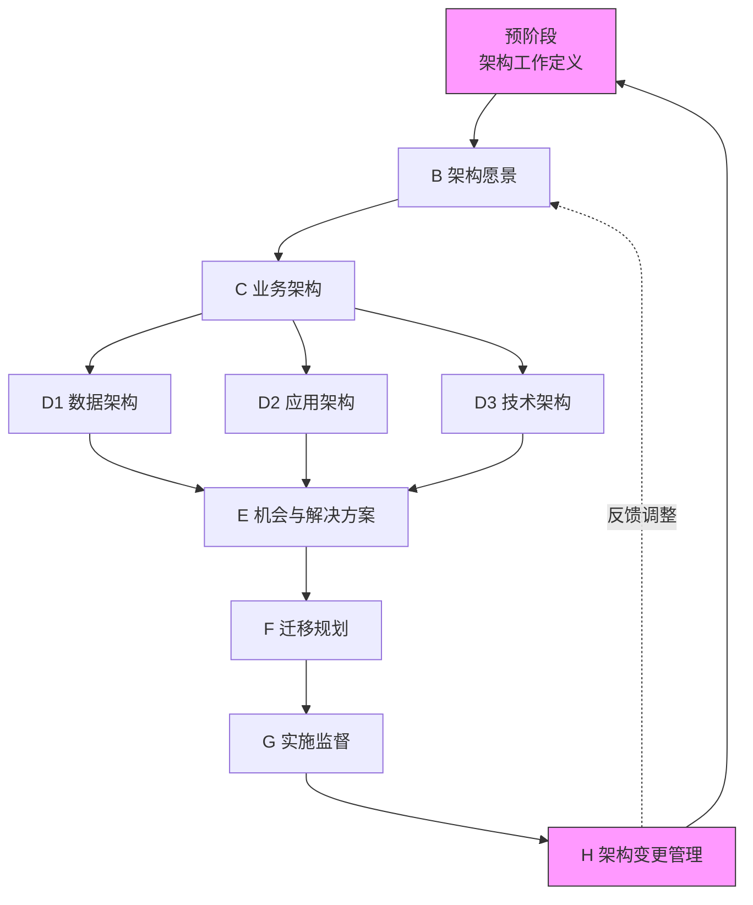
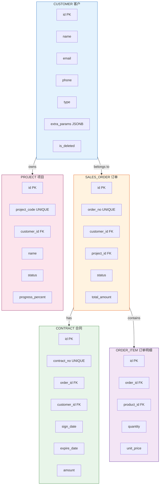
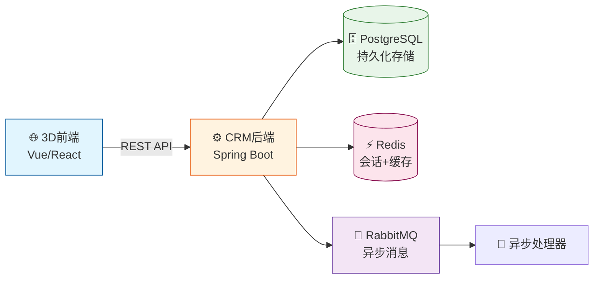
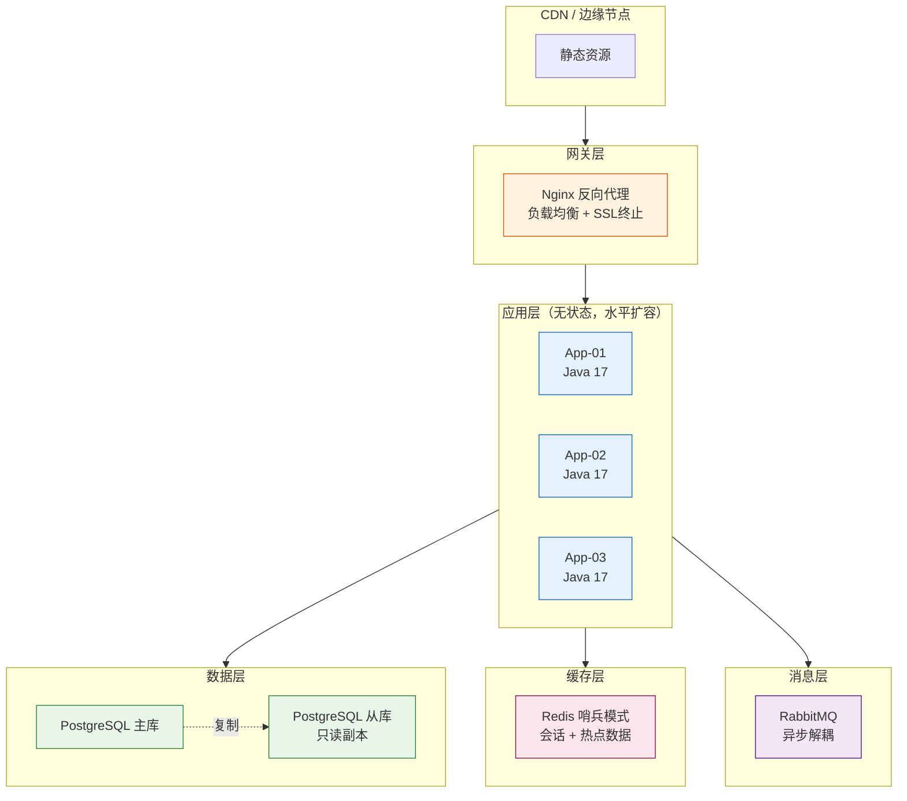
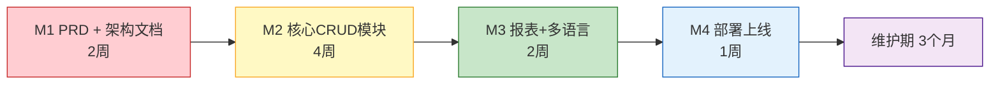
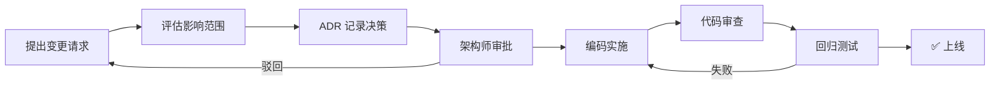

# TOGAF 企业架构开发规范（精简版）

> 适用场景：本项目整体架构设计与交付物管理
> 核心思想：用 ADM（架构开发方法）规范化地推进架构工作

---

## 一、ADM 架构开发循环

### 1.1 循环流程图



### 1.2 各阶段产出物对照

| 阶段 | 名称 | 本项目产出物 | 状态 |
|------|------|------------|------|
| 预阶段 | 架构工作定义 | 项目章程、架构治理规则 | 已有（合作意向书） |
| B | 架构愿景 | docs/vision.md | 待创建 |
| C | 业务架构 | docs/business-architecture.md | 待创建 |
| D1 | 信息系统-数据架构 | docs/data-architecture.md | 待创建 |
| D2 | 信息系统-应用架构 | docs/application-architecture.md | 待创建 |
| D3 | 技术架构 | docs/technology-architecture.md | 待创建 |
| E | 机会与解决方案 | docs/roadmap.md | 待创建 |
| F | 迁移规划 | docs/migration-plan.md | 待创建 |
| G | 实施监督 | CI/CD 流水线、监控 | 待创建 |
| H | 架构变更管理 | 变更日志、版本记录 | 待创建 |

---

## 二、架构交付物模板

### 2.1 架构愿景文档（Phase B）

**文件：docs/vision.md**

#### 1. 项目背景
- 业务驱动力
- 利益相关方清单

#### 2. 架构约束
- 技术约束（必须使用 PostgreSQL）
- 业务约束（3D前端由其他方负责）
- 非功能约束（兼职开发，周期3-5个月）

#### 3. 关键决策记录

| 决策 | 选项A | 选项B | 选择 | 理由 |
|------|-------|-------|------|------|
| 后端语言 | Java/Spring Boot | Node.js/Express | ? | ? |

#### 4. 验收标准
- 功能验收项
- 性能指标（API响应 < 200ms）
- 安全指标

---

### 2.2 业务架构文档（Phase C）

**文件：docs/business-architecture.md**

#### 1. 用户角色与权限矩阵

| 角色 | 客户管理 | 订单管理 | 合同管理 | 项目管理 | 系统管理 |
|------|---------|---------|---------|---------|---------|
| 销售 | CRUD | R | R | R | - |
| 项目经理 | R | CRUD | CRUD | CRUD | - |
| 财务 | R | R | CRUD | - | - |
| 管理员 | CRUD | CRUD | CRUD | CRUD | CRUD |

#### 2. 业务能力地图
- 客户能力域：客户录入、客户跟进、客户分层
- 交易能力域：订单创建、订单跟踪、合同管理
- 项目能力域：项目规划、进度管理、资源分配

---

### 2.3 数据架构文档（Phase D1）

**文件：docs/data-architecture.md**

#### 1. 核心实体关系图



#### 2. 数据安全分级

| 级别 | 数据类型 | 加密要求 |
|------|---------|---------|
| P0 | 密码、密钥 | AES-256 |
| P1 | 手机号、身份证 | 脱敏存储 |
| P2 | 客户名称、邮箱 | 访问控制 |
| P3 | 订单金额、状态 | 常规安全 |

---

### 2.4 应用架构文档（Phase D2）

**文件：docs/application-architecture.md**

#### 1. 系统上下文图



#### 2. 模块划分

| 模块 | 职责 | 技术 | 接口 |
|------|------|------|------|
| auth | 认证授权 | JWT + BCrypt | /api/auth/* |
| customer | 客户管理 | CRUD + 搜索 | /api/customers/* |
| order | 订单管理 | 状态机 | /api/orders/* |
| contract | 合同管理 | 生命周期 | /api/contracts/* |
| project | 项目管理 | 进度跟踪 | /api/projects/* |
| report | 数据报表 | 聚合查询 | /api/reports/* |

#### 3. API 设计规范
- RESTful 风格
- 统一响应格式：`{code, message, data, timestamp}`
- 分页：`?page=1&size=20`
- 筛选：`?status=active&created_after=2026-01-01`

---

### 2.5 技术架构文档（Phase D3）

**文件：docs/technology-architecture.md**

#### 1. 技术栈选型

| 层级 | 技术 | 版本 | 选型理由 |
|------|------|------|---------|
| 运行时 | Java | 17 LTS | 企业级稳定性 |
| 框架 | Spring Boot | 3.x | 生态完善 |
| ORM | MyBatis-Plus | 3.5+ | 开发效率高 |
| 数据库 | PostgreSQL | 15+ | 本项目强制 |
| 缓存 | Redis | 7.x | 会话+热点数据 |
| 消息 | RabbitMQ | 3.x | 异步解耦 |
| 容器 | Docker | latest | 一键部署 |
| CI/CD | GitHub Actions | - | 自动化 |

#### 2. 部署架构图



#### 3. 高可用设计
- 数据库主从复制 + 自动故障切换
- 应用无状态设计，支持水平扩容
- Redis Sentinel 高可用
- 定期备份策略（每日全量 + 每小时增量）

---

### 2.6 迁移规划文档（Phase F）

**文件：docs/migration-plan.md**

#### 里程碑时间线



| 阶段 | 交付物 | 工期 | 付款节点 |
|------|--------|------|---------|
| M1 | PRD + 架构文档 | 2周 | 20% |
| M2 | 核心CRUD模块 | 4周 | 30% |
| M3 | 报表+多语言 | 2周 | 10% |
| M4 | 部署上线 | 1周 | 10% |
| 维护 | 3个月维护期 | 3个月 | 尾款10% |

#### 风险缓解

| 风险 | 概率 | 影响 | 应对措施 |
|------|------|------|---------|
| 需求变更频繁 | 中 | 高 | 阶段验收+变更流程 |
| 客户付款延迟 | 中 | 中 | 预付款30%保底 |
| 技术债务累积 | 低 | 中 | 每迭代代码审查 |

---

## 三、架构决策记录（ADR）

每个重大技术决策用 ADR 记录：

```markdown
# ADR-001: 选择 PostgreSQL 作为主数据库

状态：已接受
日期：2026-08-20
上下文：项目需要强一致性事务、复杂查询、JSONB 支持扩展字段
决策：选用 PostgreSQL 15+，放弃 MySQL
后果：
- 优点：原生 JSONB、CTE 递归查询、更好的并发控制
- 缺点：团队需学习曲线、运维成本略高
```

---

## 四、架构治理

### 4.1 变更流程



### 4.2 架构审查要点

- [ ] 是否符合分层架构？
- [ ] 是否有循环依赖？
- [ ] 数据库设计是否符合第三范式？
- [ ] API 是否遵循 RESTful 规范？
- [ ] 安全设计是否完整？
- [ ] 性能设计是否合理？
- [ ] 是否有关键的单点故障？

---

*文档创建日期：2026-08-20*
*参考来源：TOGAF 9.2 框架（架构开发方法 ADM）*
