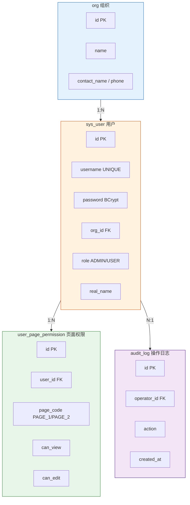

# crm-user-auth 子模块 - 实现计划

> 创建日期：2026-08-20
> 状态：**已完成且全量验收通过** (2026-08-24)
> 后端：http://localhost:8080 | 前端：http://localhost:5173
> 默认账号：admin / admin123

---

## 环境准备

### PostgreSQL（Docker）

```bash
docker run -d --name pg-local \
  -e POSTGRES_PASSWORD=MyPass123456 \
  -p 127.0.0.1:5432:5432 \
  -v pg_local_data:/var/lib/postgresql/data \
  postgres:15

# 创建数据库
docker exec pg-local createdb -U postgres crm_user_auth
```

### 连接信息
- JDBC URL: `jdbc:postgresql://localhost:5432/crm_user_auth`
- 用户名: `postgres`
- 密码: `MyPass123456`

---

在 CRM + 3D 模块化住房管理系统中新增**用户管理子模块**，作为第一个可交付功能。

---

## 技术栈

| 层次 | 技术 | 版本 |
|------|------|------|
| 后端框架 | Spring Boot | 3.2.x |
| ORM | MyBatis-Plus | 3.5.x |
| 数据库 | PostgreSQL | 15+ |
| 缓存 | Redis | 7.x（Token 黑名单用） |
| 安全 | Spring Security + JWT | — |
| 前端框架 | Vue 3 | 3.4+ |
| 前端构建 | Vite | 5.x |
| UI 组件库 | Element Plus | 2.x |
| 状态管理 | Pinia | 2.x |
| 路由 | Vue Router | 4.x |
| HTTP 客户端 | Axios | 1.x |

---

## 目录结构

```
crm-user-auth/
├── backend/                        # Spring Boot 后端
│   ├── pom.xml
│   └── src/
│       ├── main/
│       │   ├── java/com/example/crm/userauth/
│       │   │   ├── UserAuthApplication.java
│       │   │   ├── module/
│       │   │   │   ├── auth/       # 认证授权（登录/JWT/权限过滤）
│       │   │   │   ├── org/        # 组织管理
│       │   │   │   ├── user/       # 用户管理
│       │   │   │   └── permission/ # 页面权限
│       │   │   ├── config/         # Spring Security/MyBatis/Redis 配置
│       │   │   └── common/         # 统一响应/异常处理
│       │   └── resources/
│       │       ├── application.yml
│       │       └── db/migration/V1__init_schema.sql
│       └── test/java/              # JUnit5 + Mockito 测试
│
├── frontend/                       # Vue 3 前端
│   ├── package.json
│   ├── vite.config.ts
│   ├── index.html
│   └── src/
│       ├── main.ts                 # 入口，注册 Pinia/Router/Element Plus
│       ├── views/
│       │   ├── LoginPage.vue       # 账号密码登录页
│       │   ├── OrgManagePage.vue   # 组织管理页
│       │   ├── UserManagePage.vue  # 用户管理页
│       │   ├── Page1.vue           # 业务页面1
│       │   └── Page2.vue           # 业务页面2
│       ├── components/
│       │   └── PermissionGuard.vue # 路由权限守卫
│       ├── router/
│       │   └── index.ts            # 路由配置（含权限控制）
│       ├── stores/
│       │   └── auth.ts             # Pinia 状态管理
│       └── api/
│           └── auth.ts             # Axios 封装 + Token 拦截
│
└── docs/
    └── README.md
```

---

## 数据库设计（PostgreSQL）

### 4 张表

**org（组织）**
```sql
id              BIGSERIAL PK
name            VARCHAR(100) NOT NULL
contact_name    VARCHAR(50)
contact_phone   VARCHAR(20)
is_active       BOOLEAN NOT NULL DEFAULT true
created_at      TIMESTAMPTZ NOT NULL DEFAULT NOW()
updated_at      TIMESTAMPTZ NOT NULL DEFAULT NOW()
is_deleted      BOOLEAN NOT NULL DEFAULT false
deleted_at      TIMESTAMPTZ
```

**sys_user（用户表，避开 SQL 保留字 user）**
```sql
id              BIGSERIAL PK
username        VARCHAR(50) UNIQUE NOT NULL
password        VARCHAR(255) NOT NULL        -- BCrypt 加密 strength=12
email           VARCHAR(100)
phone           VARCHAR(20)
real_name       VARCHAR(50)
org_id          BIGINT FK -> org.id          -- NULL = 个人用户
role            VARCHAR(20) NOT NULL DEFAULT 'USER'  -- ADMIN / USER
is_active       BOOLEAN NOT NULL DEFAULT true
created_at      TIMESTAMPTZ NOT NULL DEFAULT NOW()
updated_at      TIMESTAMPTZ NOT NULL DEFAULT NOW()
created_by      BIGINT FK -> sys_user.id
is_deleted      BOOLEAN NOT NULL DEFAULT false
deleted_at      TIMESTAMPTZ

索引: idx_sys_user_org_id, idx_sys_user_username
```

**user_page_permission（用户页面权限）**
```sql
id              BIGSERIAL PK
user_id         BIGINT NOT NULL FK -> sys_user.id
page_code       VARCHAR(50) NOT NULL         -- PAGE_1 / PAGE_2
can_view        BOOLEAN NOT NULL DEFAULT true
can_edit        BOOLEAN NOT NULL DEFAULT false
created_at      TIMESTAMPTZ NOT NULL DEFAULT NOW()
created_by      BIGINT FK -> sys_user.id
is_deleted      BOOLEAN NOT NULL DEFAULT false

唯一索引: uq_user_page (user_id, page_code)
```

**audit_log（操作日志）**
```sql
id              BIGSERIAL PK
operator_id     BIGINT FK -> sys_user.id
action          VARCHAR(100) NOT NULL
target_type     VARCHAR(50)                  -- USER / ORG / PERMISSION
target_id       BIGINT
detail          TEXT
ip_address      VARCHAR(45)
created_at      TIMESTAMPTZ NOT NULL DEFAULT NOW()

索引: idx_audit_operator, idx_audit_created_at
```

---

## ER 关系图



---

## API 设计

### 认证 `/api/auth/`

| 方法 | 路径 | 说明 | 权限 |
|------|------|------|------|
| POST | `/api/auth/login` | 账号密码登录，返回 JWT | 公开 |
| POST | `/api/auth/logout` | 登出 | 已登录 |
| GET | `/api/auth/me` | 当前用户信息（含权限列表） | 已登录 |
| POST | `/api/auth/refresh` | 刷新 Token | 已登录 |

### 组织 `/api/orgs/`

| 方法 | 路径 | 说明 | 权限 |
|------|------|------|------|
| POST | `/api/orgs` | 创建组织 | ADMIN |
| GET | `/api/orgs` | 组织列表（分页） | ADMIN |
| GET | `/api/orgs/{id}` | 组织详情 | ADMIN |
| PUT | `/api/orgs/{id}` | 更新组织 | ADMIN |
| DELETE | `/api/orgs/{id}` | 软删除 | ADMIN |

### 用户 `/api/users/`

| 方法 | 路径 | 说明 | 权限 |
|------|------|------|------|
| POST | `/api/users` | 创建用户（可指定 org_id） | ADMIN |
| GET | `/api/users` | 用户列表（分页+筛选） | ADMIN |
| GET | `/api/users/{id}` | 用户详情 | ADMIN |
| PUT | `/api/users/{id}` | 更新用户 | ADMIN |
| DELETE | `/api/users/{id}` | 软删除 | ADMIN |
| POST | `/api/users/{id}/reset-password` | 重置密码 | ADMIN |

### 权限 `/api/users/{userId}/permissions`

| 方法 | 路径 | 说明 | 权限 |
|------|------|------|------|
| GET | `/api/users/{userId}/permissions` | 获取用户所有页面权限 | ADMIN |
| PUT | `/api/users/{userId}/permissions` | 批量设置页面权限 | ADMIN |

---

## 权限模型

```
ADMIN（管理员）── 默认拥有所有页面的查看+编辑权限，无需在 permission 表记录
USER（普通用户）── 从 user_page_permission 表动态读取

页面权限字段：
  can_view = true  → 可查看该页面
  can_edit = true  → 可编辑该页面内容

特殊规则：
  - org_id = NULL → 个人用户（不属于任何组织）
  - 密码用 BCrypt（strength=12）存储
  - 所有写操作记录 audit_log
  - Admin 初始化账号：admin / admin123
```

---

## 前端页面设计（Vue 3）

| 页面 | 路由 | 权限要求 | 说明 |
|------|------|---------|------|
| 登录页 | `/login` | 公开 | 账号密码表单 + 记住我 |
| 组织管理 | `/orgs` | ADMIN | 组织 CRUD 列表（Element Plus Table） |
| 用户管理 | `/users` | ADMIN | 用户 CRUD + 授权管理 |
| 页面1 | `/page1` | 有 PAGE_1 权限 | 业务页面1示例 |
| 页面2 | `/page2` | 有 PAGE_2 权限 | 业务页面2示例 |

---

## 实现步骤（按顺序执行）

### Phase 1：后端骨架
1. 初始化 Spring Boot 项目（pom.xml 依赖：Spring Boot 3.2, MyBatis-Plus, Spring Security, jjwt, Spring Data Redis）
2. 建表 DDL — Flyway 迁移脚本 V1__init_schema.sql
3. Entity + Mapper — 4 张表的实体类和 Mapper 接口
4. 统一响应体 Result<T> + GlobalExceptionHandler
5. Redis 配置（Token 黑名单用）

### Phase 2：认证模块
6. JwtUtils — Token 生成和验证
7. SecurityFilter — JWT 过滤器链
8. AuthService — 登录逻辑（BCrypt 校验 → 签发 JWT → 存入 Redis）
9. SecurityConfig — 白名单配置（/api/auth/login 等）

### Phase 3：业务模块
10. OrgService — 组织 CRUD
11. UserService — 用户 CRUD（含关联 org_id 验证）
12. PermissionService — 页面权限读写
13. AuditService — 操作日志记录

### Phase 4：前端
14. 初始化 Vue 3 项目（Vite + Element Plus + Pinia + Vue Router + Axios）
15. AuthStore — Pinia 状态（用户信息、Token、权限列表）
16. 登录页 LoginPage.vue
17. 权限路由守卫 PermissionGuard.vue
18. 组织管理页 OrgManagePage.vue
19. 用户管理页 UserManagePage.vue（含授权面板）
20. 页面1/2 示例页

### Phase 5：测试
21. 单元测试 — AuthService（登录成功/失败/密码错误）
22. 单元测试 — UserService（创建用户/权限分配）
23. 单元测试 — PermissionService（权限判断）
24. 集成测试 — 完整登录→创建组织→创建用户→分配权限→验证流程
25. 修复发现的问题，直到所有测试通过

---

## 验证标准

- [ ] 用 admin/admin123 登录成功，获取 JWT Token
- [ ] 创建组织（POST /api/orgs），返回组织 ID
- [ ] 在组织下创建用户（POST /api/users），org_id 正确关联
- [ ] 给个人用户创建权限（org_id=null）
- [ ] 给普通用户分配 PAGE_1 查看权限
- [ ] 用该用户登录，只能访问 PAGE_1，PAGE_2 被拦截
- [ ] 给该用户分配 PAGE_2 编辑权限，可以访问并编辑 PAGE_2
- [ ] 管理员重置用户密码后，旧密码立即失效
- [ ] 所有单元测试通过（JUnit5 + Mockito）
- [ ] 前端登录流程完整可用
