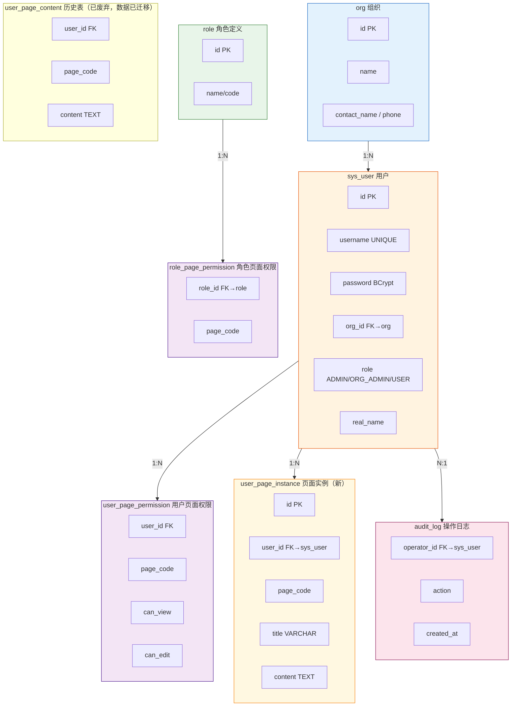

# 数据库文档 — crm_user_auth

**数据库类型**: PostgreSQL 15  
**容器名**: `pg-local`（Docker）  
**连接**: `jdbc:postgresql://localhost:5432/crm_user_auth`  
**用户/密码**: `postgres / MyPass123456`

---

## ER 关系图



---

## 表结构说明

### org（组织）
| 字段 | 类型 | 约束 | 说明 |
|------|------|------|------|
| id | bigint | PK, 自增 | 主键 |
| name | varchar(100) | NOT NULL | 组织名称 |
| contact_name | varchar(50) | | 联系人 |
| contact_phone | varchar(20) | | 联系电话 |
| is_active | boolean | NOT NULL, DEFAULT true | 是否启用 |
| created_at | timestamptz | NOT NULL, DEFAULT NOW() | 创建时间 |
| updated_at | timestamptz | NOT NULL, DEFAULT NOW() | 更新时间 |
| is_deleted | boolean | NOT NULL, DEFAULT false | 软删除标记 |
| deleted_at | timestamptz | | 软删除时间 |

**索引**: `idx_org_is_deleted` (WHERE is_deleted = false)

---

### sys_user（用户）
| 字段 | 类型 | 约束 | 说明 |
|------|------|------|------|
| id | bigint | PK, 自增 | 主键 |
| username | varchar(50) | UNIQUE, NOT NULL | 登录账号 |
| password | varchar(255) | NOT NULL | BCrypt 加密（strength=12） |
| real_name | varchar(50) | | 真实姓名 |
| org_id | bigint | FK→org.id, ON DELETE SET NULL | 所属组织（NULL=个人用户） |
| role | varchar(20) | NOT NULL, DEFAULT 'USER' | ADMIN / ORG_ADMIN / USER |
| is_org_admin | boolean | NOT NULL, DEFAULT false | 组织管理员标记（冗余） |
| is_active | boolean | NOT NULL, DEFAULT true | 是否启用 |
| created_by | bigint | FK→sys_user.id | 创建人 |
| created_at | timestamptz | NOT NULL, DEFAULT NOW() | 创建时间 |
| updated_at | timestamptz | NOT NULL, DEFAULT NOW() | 更新时间 |
| is_deleted | boolean | NOT NULL, DEFAULT false | 软删除标记 |
| deleted_at | timestamptz | | 软删除时间 |

**索引**: `sys_user_username_key` (UNIQUE), `idx_sys_user_org_id`, `idx_sys_user_role`, `idx_sys_user_username`（均 WHERE is_deleted = false）

---

### user_page_instance（页面实例，V6 新增）
| 字段 | 类型 | 约束 | 说明 |
|------|------|------|------|
| id | bigint | PK, 自增 | 主键 |
| user_id | bigint | FK→sys_user.id, ON DELETE CASCADE, NOT NULL | 所属用户 |
| page_code | varchar(50) | NOT NULL | 页面模板标识（PAGE_1 / PAGE_2 等） |
| title | varchar(200) | | 实例名称（便于区分，可为空） |
| content | text | | JSON 内容 |
| sort_order | integer | NOT NULL, DEFAULT 0 | 排序权重 |
| created_by | bigint | FK→sys_user.id | 创建人 |
| created_at | timestamptz | NOT NULL, DEFAULT NOW() | 创建时间 |
| updated_at | timestamptz | NOT NULL, DEFAULT NOW() | 更新时间 |
| is_deleted | boolean | NOT NULL, DEFAULT false | 软删除标记 |
| deleted_at | timestamptz | | 软删除时间 |

**索引**: `uqi_upi_user_page_title` (UNIQUE, WHERE is_deleted=false), `idx_upi_user_id`, `idx_upi_page_code`

**数量限制**:
- USER 角色：每个 page_code 最多 5 个实例
- ORG_ADMIN 角色：每个 page_code 最多 20 个实例
- ADMIN 角色：无限制

---

### user_page_permission（用户页面权限）
| 字段 | 类型 | 约束 | 说明 |
|------|------|------|------|
| id | bigint | PK, 自增 | 主键 |
| user_id | bigint | FK→sys_user.id, NOT NULL | 用户 |
| page_code | varchar(50) | NOT NULL | 页面标识 |
| can_view | boolean | NOT NULL, DEFAULT true | 可查看 |
| can_edit | boolean | NOT NULL, DEFAULT false | 可编辑 |
| created_by | bigint | FK→sys_user.id | 授权人 |
| created_at | timestamptz | NOT NULL, DEFAULT NOW() | 创建时间 |
| is_deleted | boolean | NOT NULL, DEFAULT false | 软删除标记 |
| deleted_at | timestamptz | | 软删除时间 |

**唯一索引**: `uq_user_page` (user_id, page_code WHERE is_deleted=false)

---

### user_page_content（历史表，V1-V5 数据已迁移至 user_page_instance）
保留但不再使用，数据已迁至 `user_page_instance`。

---

### role（角色定义）
| 字段 | 类型 | 约束 | 说明 |
|------|------|------|------|
| id | bigint | PK, 自增 | 主键 |
| name | varchar(50) | NOT NULL | 角色名称 |
| code | varchar(50) | UNIQUE, NOT NULL | 角色编码 |
| description | varchar(200) | | 描述 |
| is_system | boolean | NOT NULL, DEFAULT false | 系统预置角色不可删除 |
| created_at | timestamptz | NOT NULL, DEFAULT NOW() | 创建时间 |
| updated_at | timestamptz | NOT NULL, DEFAULT NOW() | 更新时间 |

---

### role_page_permission（角色页面权限）
| 字段 | 类型 | 约束 | 说明 |
|------|------|------|------|
| id | bigint | PK, 自增 | 主键 |
| role_id | bigint | FK→role.id, ON DELETE CASCADE, NOT NULL | 角色 |
| page_code | varchar(50) | NOT NULL | 页面标识 |
| can_view | boolean | NOT NULL, DEFAULT true | 可查看 |
| can_edit | boolean | NOT NULL, DEFAULT false | 可编辑 |
| created_at | timestamptz | NOT NULL, DEFAULT NOW() | 创建时间 |

**唯一索引**: `role_page_permission_role_id_page_code_key`

---

### audit_log（操作日志）
| 字段 | 类型 | 约束 | 说明 |
|------|------|------|------|
| id | bigint | PK, 自增 | 主键 |
| operator_id | bigint | FK→sys_user.id | 操作人 |
| action | varchar(100) | NOT NULL | 操作类型（CREATE_USER / ASSIGN_PERMISSION 等） |
| target_type | varchar(50) | | 目标类型（USER / ORG / PERMISSION 等） |
| target_id | bigint | | 目标 ID |
| detail | text | | 详情 |
| ip_address | varchar(45) | | 操作 IP |
| created_at | timestamptz | NOT NULL, DEFAULT NOW() | 操作时间 |

**索引**: `idx_audit_operator`, `idx_audit_created_at`（DESC）

---

## 建库命令

```bash
# 方式一：通过 Docker 容器
docker exec -it pg-local createdb -U postgres crm_user_auth_new

# 方式二：通过 psql 命令行
psql -U postgres -c "CREATE DATABASE crm_user_auth_new;"

# 方式三：通过 Flyway 自动迁移（启动 Spring Boot 时自动执行）
# application.yml 中 flyway.enabled=true，首次启动会自动建表
```

---

## 删库命令

```bash
# 删除数据库（⚠️ 危险操作，数据不可恢复）
docker exec -it pg-local dropdb -U postgres crm_user_auth_new

# 删除前先确认数据库存在
docker exec pg-local psql -U postgres -l | grep crm_user_auth_new
```

---

## 回滚方案

Flyway 本身不支持直接回滚（无 rollback SQL 脚本），如需回滚到 V5 状态：

### 停服务
```bash
pkill -f "crm-user-auth"
```

### 备份当前数据库
```bash
docker exec pg-local pg_dump -U postgres crm_user_auth > backup_v5_to_v6.sql
```

### 手动执行反向 SQL
```sql
-- 恢复 user_page_content 数据（如有需要）
INSERT INTO user_page_content (user_id, page_code, content, updated_by, created_at, updated_at, is_deleted)
SELECT user_id, page_code, content, created_by, created_at, updated_at, false
FROM user_page_instance WHERE is_deleted = false;

-- 删除新表
DROP TABLE IF EXISTS user_page_instance;
DROP TABLE IF EXISTS role_page_permission;
DROP TABLE IF EXISTS role;
```

### 从 Flyway 历史中删除 V6 记录
```sql
DELETE FROM flyway_schema_history WHERE version = '6';
```

### 重启服务
```bash
java -jar target/crm-user-auth-1.0.0-SNAPSHOT.jar > /tmp/backend.log 2>&1 &
```

---

## 测试账号

| 用户名 | 密码 | 角色 | org_id |
|--------|------|------|--------|
| admin | admin123 | ADMIN | null |
| orgadmin | test123456 | ORG_ADMIN | 3 |
| user1 | test123456 | USER | 3 |
